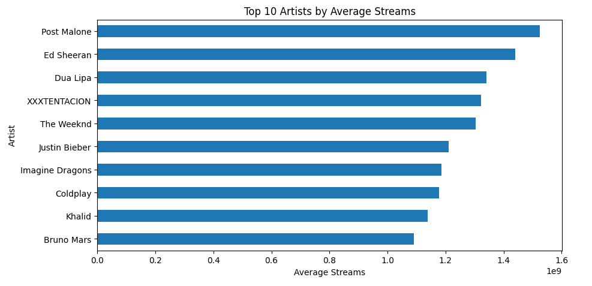

# Spotify Data Analysis
## Project Overview
This project focuses on analyzing a Spotify dataset to explore music trends, artist performance, and relationships between song features and popularity.

The goal of the analysis is to understand how different factors such as artist, song duration, and audio characteristics influence streaming performance.

---

## Spotify Dataset Description

This project uses a Spotify dataset that contains information about songs, artists, and audio features. The dataset includes details such as track name, artist, album type, duration, and number of streams.

It also provides audio characteristics like danceability, which help analyze listener preferences and music trends.

The dataset is suitable for exploring relationships between song features and popularity, as well as identifying patterns in artist performance and music engagement.

Source: Kaggle

---

 ## Tools & Technologies
- Python  
- Pandas  
- NumPy  
- Matplotlib  
- Seaborn  
- Jupyter Notebook / Google Colab

 --- 

## Analysis Performed

The following analyses were conducted:

- Data cleaning and preprocessing  
- Exploratory Data Analysis (EDA)  
- Top songs based on streams  
- Artist-level analysis (average streams)  
- Relationship between danceability and streams  
- Distribution analysis of streams and duration  
- Album type comparison

---

## Visualization
Top 10 Artists by Average Streams

This bar chart shows the top 10 artists based on their average number of streams.
It helps identify which artists consistently achieve high listener engagement.

## Insights:
- Post Malone has the highest average streams, indicating strong and consistent popularity.  
- Ed Sheeran and Dua Lipa also rank among the top, showing stable performance across tracks.  
- A small group of artists dominates streaming numbers.  
- There is a noticeable gap between the highest and lowest performers within the top 10.  

This analysis can be useful for understanding market trends and identifying high-performing artists in the music industry.

